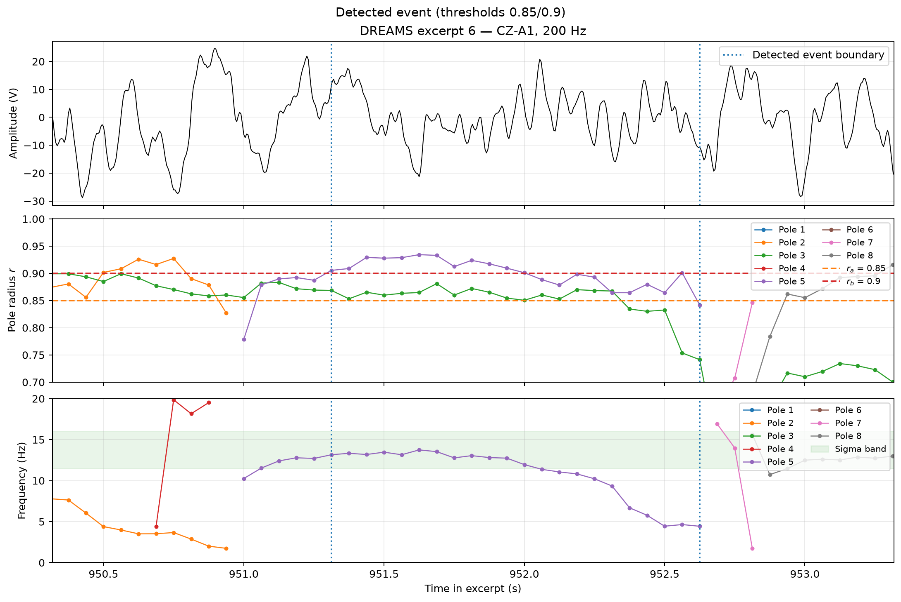

# Olbrich–Achermann Oscillatory Event Detector

A Python implementation of the autoregressive pole-based oscillatory-event detector described by Olbrich and Achermann (2005). The project applies the method to DREAMS sleep-EEG excerpts, identifies candidate spindle events, calculates NREM spindle rates, and can compare detections with expert annotations.

### Real EEG detection example

Three-second DREAMS excerpt showing the EEG, tracked AR pole radii, and pole frequencies. Dotted vertical lines indicate the detected event boundaries; pole colors are consistent between the radius and frequency panels.

<p align="center">
  
</p>

> **Paper:** E. Olbrich and P. Achermann, “Analysis of oscillatory patterns in the human sleep EEG using a novel detection algorithm,” *Journal of Sleep Research*, 14(4), 337–346, 2005. [doi:10.1111/j.1365-2869.2005.00475.x](https://doi.org/10.1111/j.1365-2869.2005.00475.x)

> **Data notice:** DREAMS recordings and annotations are not included in this repository. Obtain the dataset separately and place the permitted files in `DatabaseSpindles/`, respecting its license.

## Scientific method

The original method models short EEG segments with fixed-order autoregressive (AR) models. The complex roots of the AR polynomial are interpreted as oscillatory modes with time-varying frequency and damping. Because damping is related to pole radius, an oscillatory event is detected when a pole radius crosses predefined thresholds.

This implementation follows the main parameters described in the paper:

- AR model order `p = 8`.
- One-second EEG analysis windows.
- Coarse scanning with non-overlapping one-second steps.
- Fine scanning with overlapping windows at `1/16`-second spacing.
- Lower radius threshold `r_a = 0.90`.
- Upper radius threshold `r_b = 0.95`.
- Event onset at an upward crossing of `r_b`.
- Event termination after the last downward crossing of `r_b` before the pole falls below `r_a`.
- Event frequency and time taken from the maximum pole radius.
- Event duration including the one-second analysis-window correction described in the paper.

The paper states that more than one event can be detected when several oscillatory modes satisfy the criteria simultaneously. This behavior is the default in this project.

## Pole-tracking modes

### `all` — paper-faithful multi-mode tracking

`all` tracks every positive-frequency pole in each analysis window and maintains separate oscillator tracks. This is the default mode and should be used for results intended to follow the paper's multi-mode event definition.

### `max` — strongest-pole comparison mode

`max` keeps only the pole with the largest radius in each analysis window. This mode is useful for comparison with a single-dominant-oscillator approach, but it is not the paper's multi-oscillator behavior.

## Requirements

- Python 3.12+
- [`uv`](https://docs.astral.sh/uv/) (recommended)
- DREAMS excerpt data in `DatabaseSpindles/`

## Installation

```bash
uv sync
```

The project exposes the following command-line entry point:

```bash
uv run olbrich-achermann-spindle-detector
```

## Dataset setup

The batch runner searches `DatabaseSpindles/` for files with names matching:

```text
excerpt<N>.edf
Hypnogram_excerpt<N>.txt
Visual_scoring1_excerpt<N>.txt
Visual_scoring2_excerpt<N>.txt
```

The hypnogram and visual-scoring files are optional for detection, but they are needed for NREM-rate calculation and expert validation. The available DREAMS channel names may differ from the original paper's `C3-A2` derivation; the batch runner currently looks for `C3-A1` and then `CZ-A1`.

## Synthetic example

The self-contained demo generates a three-second signal with a synthetic
spindle and plots three aligned panels: the signal, AR pole radii with the
paper's thresholds, and estimated pole frequencies. Pole estimates are matched
between adjacent windows by nearest-frequency assignment; each track uses the
same color in the radius and frequency panels, with markers connected over
time. It does not require DREAMS data. Install the optional plotting dependency
and run it:

```bash
uv sync --extra plots
uv run python examples/synthetic_demo.py
```

This synthetic illustration is not a reproduction of the paper's EEG figure or
a scientific validation result.

## Real EEG example

The plot uses a three-second window from DREAMS excerpt 6. To regenerate it
from a local DREAMS installation:

```bash
uv run --extra plots python examples/plot_real_event.py
```

The script writes `results/excerpt6_matched_event.png`.

## Usage

Process all available excerpts using the default multi-mode detector:

```bash
uv run olbrich-achermann-spindle-detector --pole-mode all
```

Run the strongest-pole comparison mode:

```bash
uv run olbrich-achermann-spindle-detector --pole-mode max
```

The batch runner writes detector scoring files to `results/` and saves the combined summary to:

```text
results/summary.csv
```

The detector can also be configured and reused as a Python object:

```python
from olbrich_achermann_spindle_detector import SpindleDetector

detector = SpindleDetector(
    fs=128,
    r_a=0.90,
    r_b=0.95,
    pole_mode="all",
)
events = detector.detect(signal)
```

For existing code, the functional interface remains available:

```python
from olbrich_achermann_spindle_detector import detect_events

events = detect_events(signal, fs=128, r_a=0.90, r_b=0.95, pole_mode="all")
```

To inspect an algorithm scoring file:

```bash
uv run python see.py
```

## Frequency bands and spindle analysis

The underlying detector is general: it estimates oscillatory modes across the positive-frequency range rather than assuming that every event is a spindle. The paper discusses delta, alpha, and sigma oscillations. This repository uses approximately `11.5–16 Hz` as the sigma range when calculating spindle-specific statistics.

Consequently, sigma-band filtering is an analysis step applied to detected events; it should not be confused with the AR pole detector itself.

## Project layout

```text
src/olbrich_achermann_spindle_detector/
├── batch.py      # Batch orchestration and summary reporting
├── detector.py   # AR pole estimation and oscillatory-event detection
├── utils.py      # DREAMS I/O and NREM-rate helpers
└── validate.py   # Expert annotation matching and metrics
examples/
├── synthetic_demo.py     # Synthetic three-panel pole visualization
└── plot_real_event.py    # Plot one event from a local DREAMS EDF
see.py              # Scoring-file inspection helper
```

## Reproducibility and scope

This repository is intended as a transparent Python reimplementation of the method, not as a claim that the original 2005 experiment has been reproduced exactly. The original study used eight healthy young male subjects, four baseline nights per subject, a `C3-A2` derivation, and a 128 Hz sampling rate. Dataset channels, preprocessing, and annotation formats may differ here.

For scientifically comparable results, report at least:

- Dataset and channel derivation.
- Sampling rate and preprocessing.
- Thresholds `r_a` and `r_b`.
- Pole-tracking mode.
- Frequency-band definition.
- Validation and event-matching criteria.

## Development

Compile-check the Python sources with:

```bash
uv run python -m compileall -q src see.py
```

The detector currently has no automated test suite. Before treating results as a validated reproduction, test the implementation on synthetic signals containing one and multiple simultaneous oscillators and compare the event timing, duration, frequency, and count against reference results.

## Limitations

- DREAMS data are not distributed with this repository.
- Exact reproduction of the paper requires matching its data, channel derivation, preprocessing, and event postprocessing.
- Pole tracking between windows is implemented using nearest-frequency matching.
- Detector thresholds and sigma-band limits are configurable analysis choices, not universal physiological constants.
- Benchmark results should be added after evaluation on a documented dataset and protocol.

## Citation

If this project is useful in research, cite the original method:

```bibtex
@article{olbrich2005analysis,
  title   = {Analysis of oscillatory patterns in the human sleep EEG using a novel detection algorithm},
  author  = {Olbrich, Erwin and Achermann, Peter},
  journal = {Journal of Sleep Research},
  volume  = {14},
  number  = {4},
  pages   = {337--346},
  year    = {2005},
  doi     = {10.1111/j.1365-2869.2005.00475.x}
}
```

## License and dataset terms

The source code is maintained in this repository. Dataset licensing is governed by the DREAMS license supplied with the downloaded data; see `DatabaseSpindles/DREAMS_databases_License.txt` when the dataset is available locally.
